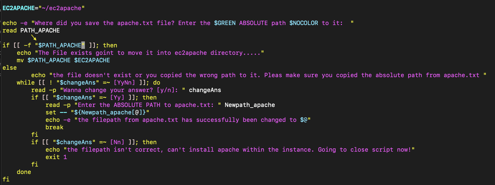
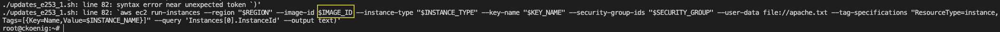
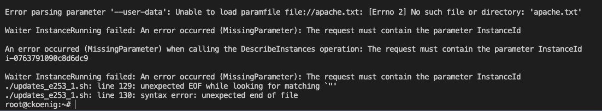

# Introduction

Hier werden wir alle unsere Testfälle dokumentieren und schildern, die wir vorgenommen haben, um die Wordpress Installation möglichst automatisiert durchzuführen und ein funktionierendes Script abgeben zu können.

# Members

Jason Norde, Ariona Elshani, Céline König

# Instructions/Description Scripts

## Bash Script

Unser erstelltes Bash-Script erstellt eine EC2-Instanz in AWS und installiert Wordpress darauf. Im selben Script wird eine zweite Instanz konfiguriert, welche haupsächlich dazu dient die Datenbank von Wordpress isoliert von der VM wo Wordpress läuft zu haben.

## Apache.txt

Diese Datei wird benötigt um bei der Konfiguration der EC2 Instanz, die Installation des Apache-Webservers direkt mitzugeben. 

# Testing 

## Testfall Codeschnipsel apache.txt
- Testzeitpunkt: 13.12.23
- Testperson: Céline König

Im anfolgenden Screenshot ist ein Codeschnipsel des ersten Entwurfs des `initialize_instances.sh` Scripts zusehen. Wobei ich testen wollte, ob sich in diesem Abschnitt ein Fehler eingeschlichen hat, weil er für mich (Céline) etwas komplexer zzum zusammenstellen war.

In diesem Ausschnit der Shell ist ersichtlich, dass ich den Schnipsel in ein seperates Script packte, weil es zu viel Aufwand wäre alles andere im Script als Kommentar zu hinterlegen. Ich vergab meinem User Ausführrechte, um das Script effektiv zu testen und startete einen ersten Versuch.
Ich erwartete, dass wenn ich den korrekten **absoluten Pfad** zu **apache.txt** angebe, dass dieses dann automatisch in den richtigen Ordner verschoben wird, um den restlichen Ablauf zu erleichtern. Es geschah allerdings nicht, egal welchen Pfad ich angab die Datei wurde nie verschoben und sprang immer direkt zum **else statement**.

Demnach suchte ich im Schnipsel den/die Fehler, welche ich nach kurzer Zeit fand, nämlich hab ich die double quotes um die Variablen vergessen, wodurch die Shell die Variablen womöglich anders interpretierte als eigentlich gewollt. Also setzte ich diese im **If-Statement** und nun trat auch dieser Schritt mal in Kraft.

Diesen Fehler hätte ich umgehen können, indem sich die Datei bereits im Ordner befindet wodurch ich mir ebenfalls einige Zeilen an Code und Zeit hätte sparen können. Jetzt sollten sich alle notwendigen Daten, die für die Initialisierung der Instanzen gebraucht werden im Ordner **ec2instances** befinden, der ohne Mühe für die Ausführung heruntergeladen und ausgeführt werden kann ohne eine Bestätigung des Pfades durch den User verlangen zu müssen.

## Fehlende Double Quotes

...

## Testfall3

## DB-Secgroup in Netzwerkinterface

In diesem Bash-Skript wird eine Elastic Network Interface (ENI) für eine Datenbankinstanz in Amazon Web Services (AWS) erstellt.

Das Skript beginnt mit einer Meldung, die mithilfe von echo -e auf der Konsole ausgegeben wird. Dabei wird vermutlich die Farbformatierung genutzt, wobei $GREEN und $NOCOLOR vordefinierte Farbcodes repräsentieren. Diese Meldung gibt Auskunft darüber, dass eine Netzwerkschnittstelle für eine Datenbankinstanz erstellt wird.

Die ENI wird mithilfe des AWS Command Line Interface (CLI) Befehls aws ec2 create-network-interface erstellt. Hierbei werden Parameter wie die Subnetz-ID (--subnet-id), die private IP-Adresse (--private-ip-address), und die Sicherheitsgruppen (--groups) angegeben. Die Ausgabe dieses Befehls wird mit --query gefiltert, um nur die ID der erstellten ENI zu extrahieren, und dann wird sie in der Variable ENI_ID gespeichert.

Wichtig ist, dass dieser Code-Abschnitt nicht den gesamten Prozess abdeckt. Üblicherweise würde im Anschluss eine AWS EC2-Datenbankinstanz erstellt und die zuvor erstellte ENI dieser Instanz zugewiesen werden. Der entsprechende Code dafür fehlt jedoch in der bereitgestellten Information.

## Error Network

Bei einem Versuch, eine Netzwerkschnittstelle für eine Datenbankinstanz in AWS zu erstellen, sind einige Probleme aufgetreten sind. Allerdings sind einige erforderliche Parameter nicht korrekt oder vollständig angegeben, was zu Fehlern führt. 

Der Befehl zum Erstellen der Netzwerkschnittstelle lautet in etwa so:

aws ec2 create-network-interface --subnet-id <Subnet-ID> ...
Leider wurde dieser Befehl nicht korrekt ausgeführt, da das erforderliche Argument --subnet-id fehlt. Es ist wichtig, das Subnetz anzugeben, in dem die Netzwerkschnittstelle erstellt werden soll.

Im Anschluss daran wurde versucht, eine Datenbankinstanz zu erstellen. Hierbei könnte es zu Fehlern gekommen sein, da möglicherweise Netzwerkschnittstellen und Instanz-spezifische Sicherheitsgruppen nicht gleichzeitig im selben Request angegeben werden können. Das führt zu einer InvalidParameterCombination-Fehlermeldung.

Beim Warten auf das Hochfahren der Instanz trat ein weiterer Fehler auf. Dieser Fehler deutet darauf hin, dass die Instanz-ID als "None" betrachtet wird, was als ungültig erkannt wurde.

Abschließend, beim Versuch, Informationen zur Instanz abzurufen, wurde ein Fehler festgestellt, da die Instanz-ID als "None" angegeben wurde, was zu einem InvalidInstanceID.Malformed-Fehler führte.

Um diese Probleme zu beheben, überprüfe die Befehlsaufrufe, um sicherzustellen, dass alle erforderlichen Parameter korrekt angegeben sind, insbesondere die Subnetz-ID beim Erstellen der Netzwerkschnittstelle. Außerdem solltest du sicherstellen, dass die Instanz-ID korrekt abgerufen wird, bevor darauf gewartet oder Informationen darüber abgerufen werden.

Ein Beispielbefehl zum Erstellen einer Netzwerkschnittstelle könnte so aussehen:

aws ec2 create-network-interface --subnet-id subnet-xyz123 --private-ip-address 10.0.0.5 --groups sg-abc456
Ersetze subnet-xyz123 und sg-abc456 durch deine tatsächlichen Subnetz-ID und Sicherheitsgruppen-ID.

## Solution Error Network

Dieses Bash-Skript automatisiert die Erstellung einer Elastic Network Interface (ENI) für eine Datenbankinstanz in Amazon Web Services (AWS).

Das Skript beginnt mit einer Kommentarzeile, die den Zweck des Codes kurz erläutert. Es wird darauf hingewiesen, dass die folgenden Befehle dazu dienen, eine Netzwerkschnittstelle für eine Datenbankinstanz in AWS zu schaffen.

Anschließend wird eine Meldung auf der Konsole ausgegeben, die den Start des Prozesses signalisiert. Die Meldung enthält Farbcodes, die wahrscheinlich für eine visuelle Hervorhebung sorgen sollen. In diesem Fall wird "Erstelle Netzwerkschnittstelle für Datenbankinstanz" in einer bestimmten Farbe angezeigt.

Der Hauptteil des Skripts enthält den Befehl zur ENI-Erstellung. Dabei wird die AWS Command Line Interface (CLI) genutzt. Die Parameter des Befehls geben an, in welchem Subnetz die ENI erstellt werden soll und welche private IP-Adresse ihr zugewiesen wird. Es wird davon ausgegangen, dass die IP-Adresse dynamisch durch die Variable $DB_PRIVATE_IP gesetzt wird. Die Ausgabe des Befehls wird gefiltert, um nur die ID der erstellten ENI zu extrahieren, und diese wird in der Variable ENI_ID gespeichert.

Dieser Code-Ausschnitt erstellt nur die ENI, nicht jedoch die gesamte Datenbankinstanz. In einem vollständigen Skript würden nach diesem Schritt weitere Befehle folgen, um die Datenbankinstanz zu erstellen und die erstellte ENI dieser Instanz zuzuweisen.

## EC2-Instanzinformationen

In diesem Screenshot wurde eine neue AWS EC2-Instanz erstellt, um Ressourcen in der Cloud zu nutzen. AWS bietet eine umfassende Dokumentation, aber diese kann aufgrund ihrer Tiefe und Komplexität schwierig zu navigieren sein. Es erfordert Zeit und Aufmerksamkeit, um die richtigen Informationen zu finden.

Die Instanz wurde am 15. Dezember 2023 um 14:36:27 UTC erstellt. Derzeit befindet sie sich im Status "pending", da sie noch startet. Die Instanz ist ein virtueller Server in der Cloud mit einer eindeutigen Instanz-ID.

Die Instanz wurde in einem bestimmten Subnetz und einer virtuellen privaten Cloud (VPC) platziert. Die private IP-Adresse der Instanz lautet 172.31.19.55, und ihr privater DNS-Name ist "ip-172-31-19-55.ec2.internal". Sie wurde in der Verfügbarkeitszone "us-east-1d" eingerichtet.

Zur Instanz gehört eine Netzwerkschnittstelle (ENI), die mit einem bestimmten Geräteindex verbunden ist. Diese Schnittstelle wird automatisch gelöscht, wenn die Instanz beendet wird.

Um die Konfiguration der Instanz abzuschließen, öffne deinen Webbrowser und navigiere zur öffentlichen IP-Adresse der Instanz. Aktuell lautet diese IP-Adresse [Instanz-Public-IP].

