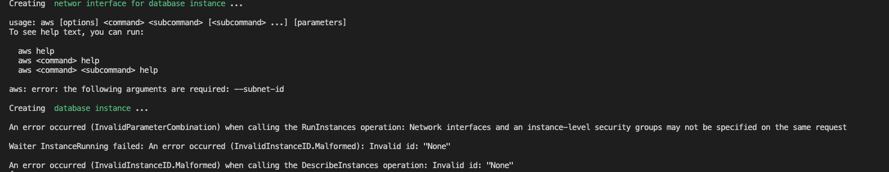
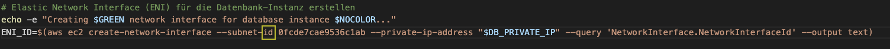
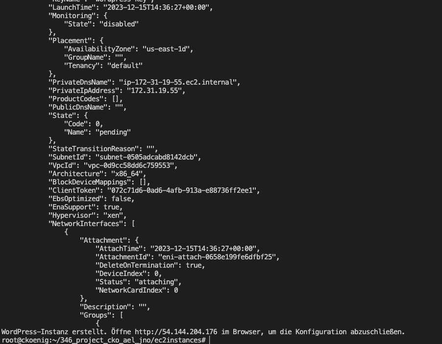
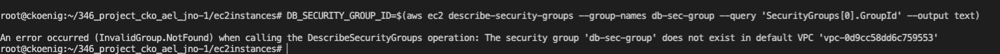
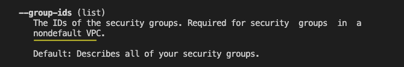
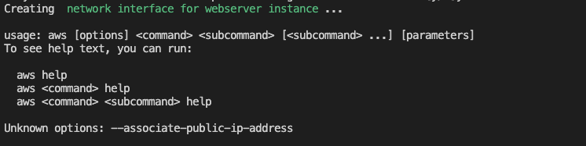
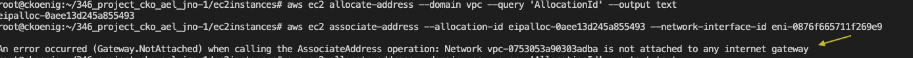
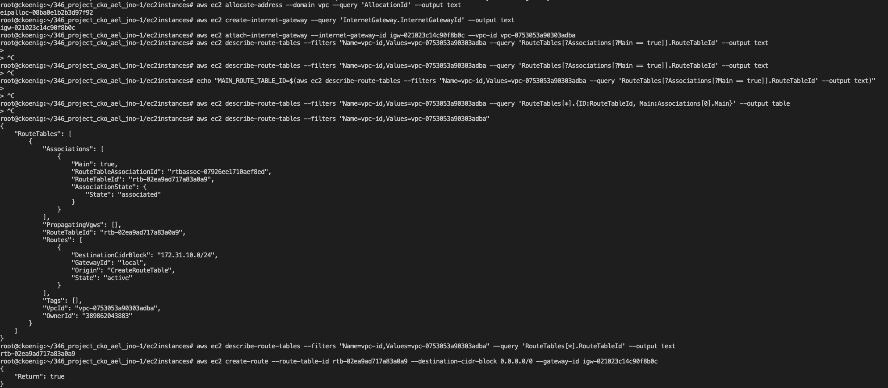

# Introduction
Hier werden wir alle unsere Testfälle dokumentieren und schildern, die wir vorgenommen haben, um die Wordpress Installation möglichst automatisiert durchzuführen und ein funktionierendes Script abgeben zu können.

# Members

Jason Norde, Ariona Elshani, Céline König

# Testing 

## Testfall Codeschnipsel apache.txt

- Testzeitpunkt: 13.12.23
- Testperson: Céline König

Im anfolgenden Screenshot ist ein Codeschnipsel des ersten Entwurfs des `initialize_instances.sh` Scripts zusehen. Wobei ich testen wollte, ob sich in diesem Abschnitt ein Fehler eingeschlichen hat, weil er für mich (Céline) etwas komplexer zum zusammenstellen war.


In diesem Ausschnit der Shell ist ersichtlich, dass ich den Schnipsel in ein seperates Script packte, weil es zu viel Aufwand wäre alles andere im Script als Kommentar zu hinterlegen. Ich vergab meinem User Ausführrechte, um das Script effektiv zu testen und startete einen ersten Versuch.
Ich erwartete, dass wenn ich den korrekten **absoluten Pfad** zu **apache.txt** angebe, dass dieses dann automatisch in den richtigen Ordner verschoben wird, um den restlichen Ablauf zu erleichtern. Es geschah allerdings nicht, egal welchen Pfad ich angab die Datei wurde nie verschoben und sprang immer direkt zum **else statement**.


Demnach suchte ich im Schnipsel den/die Fehler, welche ich nach kurzer Zeit fand, nämlich hab ich die double quotes um die Variablen vergessen, wodurch die Shell die Variablen womöglich anders interpretierte als eigentlich gewollt. Also setzte ich diese im **If-Statement** und nun trat auch dieser Schritt mal in Kraft.

Diesen Fehler hätte ich umgehen können, indem sich die Datei bereits im Ordner befindet wodurch ich mir ebenfalls einige Zeilen an Code und Zeit hätte sparen können. Jetzt sollten sich alle notwendigen Daten, die für die Initialisierung der Instanzen gebraucht werden im Ordner **ec2instances** befinden, der ohne Mühe für die Ausführung heruntergeladen und ausgeführt werden kann ohne eine Bestätigung des Pfades durch den User verlangen zu müssen.
Im Verlaufe des weiteren Troubleshootings des Projekts ergab sich eine bessere Lösung für mein Vorgehen, wodurch die Datei **apache.txt** entfernt wurde und die beiden Cloudconfig-files **cloudconfig-db** und **cloud-config-web** zustande kamen.

## Fehlende Double Quotes

- Testzeitpunkt: 14.12.23
- Testperson: Celine König
  


Bei diesem Versuch, trat ein Fehler auf, wobei der Wert der Variable **Image-ID** nicht richtig erkannt und übergeben wurde. Dies führte dazu, dass die Webserver-Instanz gar nicht erst erstellt wurde. Schritt für Schritt schaute ich den Befehl und den Output nochmals an und bemerkte den Fehler direkt.
Die Ursache für die fehlerhafte wertübergabe der Variable lag darin, dass die erforderlichen Anführungszeichen um die Variable **Image-ID** fehlten. Somit parste die Bash-shell die Variable nicht korrekt.

Das Problem konnte simpel behoben werden, indem `$IMAGE_ID` zu `"$IMAGE_ID"` geändert wurde.

## Komplexität in AWS CLI-Parametern

Dieser Screenshot weist auf mehrere Probleme der AWS-CLI Commands hin


**Probleme**

- **Parameter parsing Problem --user-data**
- **Fehlende Varibale Instance-id**

Ein Problem besteht darin, dass beim Parsen des Parameters **--user-data** die Datei **apache.txt** nicht gefunden werden konnte. Nach Angabe vom CLI heisst es, dass die Datei **apache.txt** nicht existiert. Was in der Theorie nicht möglich ist, da im vorherigen Schritt die Datei angegeben und in den Ordner **ec2instances** verschoben wird. 
Mit genauerer Überprüfung fand ich den Fehler darin, dass der verwendete `mv` Befehl beim verschieben der **apache.txt** Datei den Namen zu **ec2instances** abänderte, wodurch sich diese Fehlermeldung ergab, dass eine Datei mit diesem Namen nicht vorhanden ist. 

Zusätzlich trat ein Fehler beim Warten auf den Status **running** der Instanz auf, welcher Folgefehler verursachte und auf den fehlenden **Instanz-ID-Parameter** hinweist. Durch dass, das dieser Befehl fehlschlug, folgten die nachfolgenden Befehle ebenfalls.

Im Bash-Skript **updates_e253_1.sh** gibt es im grossen und Ganzen zwei Fehler, die mehrfach auftraten. In Zeile **129** liegt ein unerwartetes Dateiende vor (EOF) vor, während in Zeile **130** ein Syntaxfehler ist. 

In einer Analyse jedes einzelnen Befehls konnten die Fehler schliesslich entdeckt und behoben werden. Problem waren auch hier wieder das die Shell die **Instance_id** nicht richtig parsen konnte, durch das vergessene setzen von double Quotes rund um die Variable.

Nachdem diese Aspekte überprüft und korrigiert wurden, konnten die AWS-CLI-Befehle ohne Probleme ausgeführt werden. 

## Netzwerk-Interface erstellen

- Testzeitpunkt: 18.12.23
- Testperson: Celine König

Bei einem Versuch, eine Netzwerkschnittstelle für die Datenbankinstanz in AWS zu erstellen, sind einige Probleme aufgetreten. 



**Probleme**
- **Parameter Subnet-id fehlt**
- **Parameter Kombination nicht möglich**

Der Befehl zum Erstellen der Netzwerkschnittstelle lautet in etwa so: `aws ec2 create-network-interface --subnet-id <Subnet-ID> ...`
Leider wurde dieser Befehl nicht korrekt ausgeführt, da das erforderliche Argument `--subnet-id` fehlt. Grund für das auftreten dieses Fehlers war die fehlerhafte Eingabe des Parameters. Ich gab **--subnet dieeigentlichesubnetid** an anstelle von **--subnet-id eigentlichesubnetid**



Im Anschluss daran wurde versucht, eine Datenbankinstanz zu erstellen. Hierbei könnte es zu Fehlern gekommen sein, da möglicherweise Netzwerkschnittstellen und Instanz-spezifische Sicherheitsgruppen nicht gleichzeitig im selben Request angegeben werden können. Das führt zu einer InvalidParameterCombination-Fehlermeldung.
Diese Problembehebung ist etwas komplexer, aber konnte ich am Ende des Projekts schliesslich so lösen, indem ich im `aws ec2 run-instance` Befehl nicht die erstellte `ENI_ID` mitgab, indem das Subnet, wie auch die Security-Group verknüpft ist sondern dies einzeln Angab. Was wie folgt aussah: `--network-interfaces "DeviceIndex=0,SubnetId="$SUBNET_ID",Groups="$DB_SECURITY_GROUP_ID",PrivateIpAddress="$DB_PRIVATE_IP""` **(Dies ist nur ein Teil des Befehls)** 
Mit der Überprüfung stellte sich heraus, dass im selben Fall das Netzwerkinterface erstellt wurde und ich so nicht einen Befehl für die Erstellung des Netzwerkinterfaces benötige und die Erstellung der Instanz.

Beim Warten auf das Hochfahren der Instanz trat ein weiterer Fehler auf. Dieser Fehler deutet darauf hin, dass die Instanz-ID als **None** betrachtet wird, was als ungültig erkannt wurde.

Abschließend, beim Versuch, Informationen zur Instanz abzurufen, wurde ein Fehler festgestellt, da die Instanz-ID als "None" angegeben wurde, was zu einem InvalidInstanceID.Malformed-Fehler führte.

Der endgültige Befehl für die DB-Instanz Erstellung lautet wie folgt:
`aws ec2 run-instances --region "$REGION" --image-id "$IMAGE_ID" --instance-type "$INSTANCE_TYPE" --key-name "$KEY_NAME" --network-interfaces "DeviceIndex=0,SubnetId="$SUBNET_ID",Groups="$DB_SECURITY_GROUP_ID",PrivateIpAddress="$DB_PRIVATE_IP"" --user-data file://cloudconfig-db.yaml --no-associate-public-ip-address --tag-specifications "ResourceType=instance,Tags=[{Key=Name,Value=$DB_INSTANCE_NAME}]"`.

Dieser Testschritt ist essenziell, da die Datenbank schliesslich mit dem Webserver kommunizieren muss. Also testete ich das ganze einmal mehr auf Richtigkeit, was wie folgt aussah:

Der Testlauf auf nachher erfolgreich und enthielt keine parsing Probleme oder weiteres mehr. Das Netzwerk-Interface wurde korrekt erstellt und konnte korrekt übergeben werden. Damit die Variablen direkt im Shell-Output so ersichtlich waren, wie sie es jetzt sind, wurde bei den Befehlen ein `echo` Befehl vorne angefügt. Durch diesen konnte ich das Parsing direkt überpfüren ohne mühsam nachschauen zu müssen, denn wenn eines nicht geklappt hätte, dann wäre dies leer geblieben.

## Scriptdurchlauf ohne AWS-Fehlermeldung

- Testzeitpunkt: 15.12.23
- Testperson: Celine König

In diesem Screenshot wurde eine neue AWS EC2-Instanz erstellt, um Ressourcen in der Cloud zu nutzen. AWS bietet eine umfassende Dokumentation, aber diese kann aufgrund ihrer Tiefe und Komplexität schwierig zu navigieren sein. Es erfordert Zeit und Aufmerksamkeit, um die richtigen Informationen zu finden.



Die Instanz wurde am 15. Dezember 2023 um 14:36:27 UTC erstellt. Derzeit befindet sie sich im Status "pending", da sie noch startet. Die Instanz ist ein virtueller Server in der Cloud mit einer eindeutigen Instanz-ID.

Die Instanz wurde in einem bestimmten Subnetz und einer virtuellen privaten Cloud (VPC) platziert. Die private IP-Adresse der Instanz lautet 172.31.19.55, und ihr privater DNS-Name ist "ip-172-31-19-55.ec2.internal". Sie wurde in der Verfügbarkeitszone "us-east-1d" eingerichtet.

Zur Instanz gehört eine Netzwerkschnittstelle (ENI), die mit einem bestimmten Geräteindex verbunden ist. Diese Schnittstelle wird automatisch gelöscht, wenn die Instanz beendet wird.

Um die Konfiguration der Instanz abzuschließen, öffne deinen Webbrowser und navigiere zur öffentlichen IP-Adresse der Instanz. Aktuell lautet diese IP-Adresse [Instanz-Public-IP].

## Abfragen DB-Instanz

- Testzeitpunkt: 15.12.23
- Testperson: Celine König
  
In den gegebenen AWS CLI-Befehlen wird versucht, Informationen über eine EC2-Instanz abzurufen.

 

Der erste Befehl zielt darauf ab, die Instanz-ID einer EC2-Instanz zu erhalten, die den Tag "DB-Wordpress" trägt:

aws ec2 describe-instances --filters "Name=tag:Name,Values=DB-Wordpress" --query 'Reservations[0].Instances[0].InstanceId' --output text --region us-east-1

Hier wird die AWS CLI verwendet, um Instanzen anhand von Tags zu filtern. Der Filter ist auf den Tag "Name" mit dem Wert "DB-Wordpress" festgelegt. Das Ergebnis wird durch --query auf die Instanz-ID begrenzt, und --output text stellt sicher, dass die Ausgabe im Textformat erfolgt. Der Befehl wird in der Region "us-east-1" ausgeführt.

Nachdem die Instanz-ID abgerufen wurde, wird im zweiten Befehl versucht, die private IP-Adresse dieser spezifischen Instanz zu erhalten:

aws ec2 describe-instances --instance-ids i-0f18aac3467632dbb --query 'Reservations[0].Instances[0].PrivateIpAddress' --output text --region us-east-1

Hierbei wird die Instanz-ID "i-0f18aac3467632dbb" direkt angegeben, und der Befehl versucht, die private IP-Adresse dieser Instanz abzurufen. Ähnlich wie beim ersten Befehl wird durch --query und --output text festgelegt, dass nur die private IP-Adresse angezeigt wird. Auch dieser Befehl wird in der Region "us-east-1" ausgeführt.

Diese Befehle werden verwendet, um spezifische Informationen über eine EC2-Instanz mit dem Tag "DB-Wordpress" zu sammeln. Der erste Befehl dient dazu, die Instanz-ID zu identifizieren, während der zweite Befehl die private IP-Adresse dieser Instanz abruft. Es ist wichtig, dass die Werte wie die Instanz-ID und der Tag korrekt angepasst werden, um auf die entsprechenden Ressourcen zuzugreifen.


## Inbound Roules Definierung & Public IPv4 Zuweisung Webserver-Instanz

- Testzeitpunkt: 21.12.23
- Testperson: Celine König

**Problem**

Wie ich am Donnerstagabend bemerkte werden mir die Security-groups der Instanzen teilweise zwar erstellt, aber ich konnte keine in-/outbound Roule festlegen, aufgrund dieser Fehlermeldung



**Solution**

In erster Linie war icht verwirrt, denn ich wusste nicht weshalb AWS im Default VPC nach der Gruppe **db-sec-group** suchte, denn diese habe ich in einem seperaten von mir erstellten VPC beigefügt. Also begann ich ein wenig zu recherchieren und stiess nach einer gewissen Zeit hierauf:



Im AWS-Command, der die verschiedenen Regeln erstellt habe ich bis anhin immer den Gruppennamen mitgegeben, wodurch dieser Fehler auftrat. Hier ist ein Beispiel aus meinem Script, wie der Befehl aussah und wie er korrekt lautet

**Vorher**
`aws ec2 authorize-security-group-ingress --group-id "$DB_SECURITY_GROUP_NAME" --protocol tcp --port 3306 --source-group "$WP_SECURITY_GROUP_ID"`

**Nachher**
`aws ec2 authorize-security-group-ingress --group-id "$DB_SECURITY_GROUP_ID" --protocol tcp --port 3306 --source-group "$WP_SECURITY_GROUP_ID"`

Mit Dieser Änderung vergewisserte ich mich über die Korrektheit im AWS-GUI und sah, dass die Konfigruation der Regeln für die jeweiligen Gruppen nun funktionierte und die Fehlermeldung gar nicht erst auftrat.

Im Verlauf des weiteren Testings des Scripts, kam ich zum Problem, dass ich der Webserver-Instanz eine Public IPv4 IP geben muss damit ich diese schliesslich aufrufen kann. Im `aws ec2 run-instance` Befehl gibt es aber keine Möglichkeit einer Instanz automatisch eine Public-IPv4 zuzuweisen, sofern man diese in einem non-default VPC laufen lassen möchte, was bei mir der Fall ist. Im anfolgenden Screenshot ist zusehen, dass ich über den `aws ec2 run-instance` und dem Parameter `--associate-public-ip-address`, welchen Domi und ich rausfanden und testen wollten, obs funktioniert, keine IP zuweisen kann.



Ich selbst kam nicht mehr wirklich weiter, weil ich nicht wirklich wusste nach was ich überhaupt suchen muss damit ich zu meinem Ziel komme, also wandte ich mich einmal mehr an Domi. Im Austausch kamen wir dann zum Entschluss, dass ich die Zuweisung der IPv4 wirklich nicht im `aws ec2 run-instance` Befehl vergeben kann und dafür einen weiteren Befehl anwenden muss, nämlich diesen `aws ec2 allocate-address`.  Über diesen Befehl kann ich AWS direkt mitteilen, dass ich eine automatisch generierte public IPv4 erstellen möchte. 
Also recherchierte ich ein wenig wie ich folgende Anforderungen umsetzen kann:

- **Erstellung einer Public-IPv4**
- **IPv4 dem Netzwerk-Interface zuweisen**

Domi gab mir bereits eine kleine Starthilfe mit über den folgenden Link `https://docs.aws.amazon.com/cli/latest/reference/ec2/allocate-address.html`. Anhand dessen stellte ich die Befehle zusammen, die eine IP erstellen und dem Netzwerk-Interface der Webserver-Instanz zuweisen. Die so aussehen:

1. `ALLOCATION_ID=$(aws ec2 allocate-address --domain vpc --query 'AllocationId' --output text)` -> Erstellt eine IP

2. `ENI_ID_WEB=$(aws ec2 create-network-interface --subnet-id "$SUBNET_ID" --groups "$WP_SECURITY_GROUP_ID"  --query 'NetworkInterface.NetworkInterfaceId' --output text)` -> Netzwerk-Interface muss natürlich ebenfalls erstellt werden

3. `aws ec2 associate-address --allocation-id "$ALLOCATION_ID" --network-interface-id "$ENI_ID_WEB"` -> Zuweisung der IP am Netzwerk Interface


In einem ersten Testversuch dessen, stiess ich auch auf weitere Lücken die mir fehlten, wie ein GW für das erstellte Interface.



Weil dieser befehl hinzu kam musste ich den Aufbau/Ablauf des Scripts etwas erweitern, da die Folgende Anforderungen abdeckt werden müssen, damit ich die IPv4 dem Interface zuweisen kann:

- **Erstellung eines GW's**
- **Kommunikaton nach aussen ermöglichen (nochmals überprüfen)**

Mit Recherche kam ich dann auf folgende Seiten, mit denen ich die Befehle dann zusammenstellen konnte:

- `https://docs.aws.amazon.com/cli/latest/reference/ec2/create-internet-gateway.html`

- `https://docs.aws.amazon.com/cli/latest/reference/ec2/attach-internet-gateway.html`

So kam schliesslich folgender Code zusammen:

```

# Elastic Network Interface (ENI) für die Webserver-Instanz erstellen

# Elastische IPv4-Adresse erstellen
echo -e "Creating $GREEN elastic IPv4 for webserver-instance $NOCOLOR..."
ALLOCATION_ID=$(aws ec2 allocate-address --domain vpc --query 'AllocationId' --output text)

# Netzwerkschnittstelle erstellen (inklusive Zuordnung der elastischen IPv4-Adresse)
echo -e "Creating $GREEN network interface for webserver instance $NOCOLOR..."
ENI_ID_WEB=$(aws ec2 create-network-interface --subnet-id "$SUBNET_ID" --groups "$WP_SECURITY_GROUP_ID"  --query 'NetworkInterface.NetworkInterfaceId' --output text)

# Internet GW erstellen
echo -e "Creating $GREEN internet GW $NOCOLOR..."
IGW_ID=$(aws ec2 create-internet-gateway --query 'InternetGateway.InternetGatewayId' --output text)

# GW an VPC attachen
echo -e "attaching $GREEN GW to VPC $NOCOLOR..."
aws ec2 attach-internet-gateway --internet-gateway-id "$IGW_ID" --vpc-id "$VPC_ID"

# Routing Tabelle abfragen (für die ID) und anschliessend dem GW anpassen
echo -e "Updating $GREEN Routing Tables $NOCOLOR..."
ROUTE_TABLE_ID=$(aws ec2 describe-route-tables --filters "Name=vpc-id,Values="$VPC_ID"" --query 'RouteTables[*].RouteTableId' --output text)
aws ec2 create-route --route-table-id "$ROUTE_TABLE_ID" --destination-cidr-block 0.0.0.0/0 --gateway-id "$IGW_ID"

Elastische IPv4-Adresse der Netzwerkschnittstelle zuordnen 
echo -e "attaching $GREEN IP to network interface from webserver $NOCOLOR..."
aws ec2 associate-address --allocation-id "$ALLOCATION_ID" --network-interface-id "$ENI_ID_WEB"

```

Und im Testfall funktionierte dies dann erstaunlicherweise beim ersten Mal :)



Im Screenshot ist der gesammte Testlauf vom obigen Code zusehen, wobei ich alle Befehle einzeln ausgeführt habe, um die Fehlerquelle besser identifizieren zu können.


