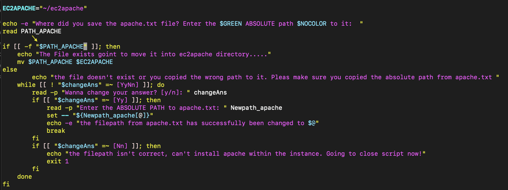

# Introduction

Hier werden wir alle unsere Testfälle dokumentieren und schildern, die wir vorgenommen haben, um die Wordpress Installation möglichst automatisiert durchzuführen und ein funktionierendes Script abgeben zu können.

# Members

Jason Norde, Ariona Elshani, Céline König

# Instructions/Description Scripts

## Bash Script

Unser erstelltes Bash-Script erstellt eine EC2-Instanz in AWS und installiert Wordpress darauf. Im selben Script wird eine zweite Instanz konfiguriert, welche haupsächlich dazu dient die Datenbank von Wordpress isoliert von der VM wo Wordpress läuft zu haben.

## Apache.txt

Diese Datei wird benötigt um bei der Konfiguration der EC2 Instanz, die Installation des Apache-Webservers direkt mitzugeben. 

# Testing 

## Testfall Codeschnipsel apache.txt

## Testfall1

